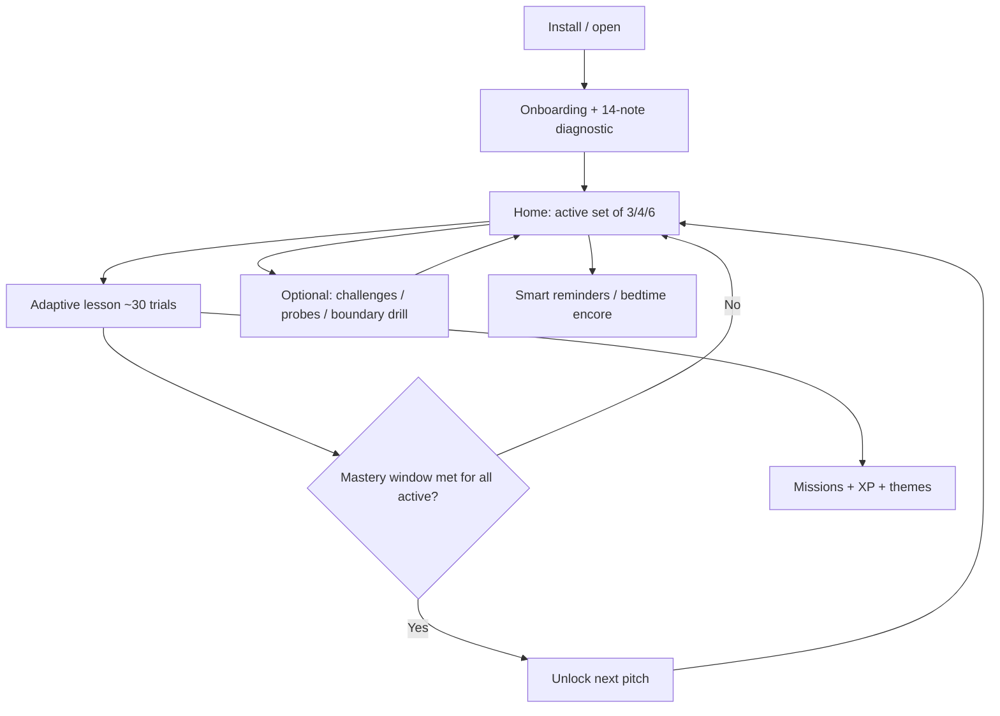

# ChromaP — Product & Algorithm Report

**App name:** ChromaP  
**Package:** `com.pitchforge.app`  
**Version:** 1.0.0 (versionCode 1)  
**Scope:** Verified against application source under `pitchforge/app/src/main`  
**Database:** Room `pitchforge.db` version **7**  
**Audience:** Product, research, and engineering reference for how the trainer thinks and behaves  

---

## 1. Philosophy — how ChromaP is meant to work

ChromaP is an **absolute-pitch acquisition trainer for adults**, not a relative-pitch ear-training game. Absolute pitch (AP) is the ability to name a tone’s chroma (C, C♯, …) **without** an external reference. Relative pitch is easier for most musicians and is exactly what ChromaP tries **not** to teach by accident.

The product philosophy is grounded in published adult AP acquisition research (Wong et al., 2019, 2020, 2025) and encoded directly in the algorithm:

### 1.1 Absolute naming over interval comparison

If two consecutive trials are a half-step apart, many learners answer the second note by thinking “one higher than the last one.” That is relative pitch. ChromaP therefore:

- Enforces a **minimum chroma distance** between consecutive lesson trials (2–4 semitones depending on active-set size).
- Inserts **colored-noise washouts** and occasional **dissonant cluster chords** between trials so the previous pitch is harder to hold in echoic memory.
- Inserts **cold-start probes** (long silence after a brief clear) so some trials arrive with no usable recent reference.
- Treats the **first note of each daily lesson** as a true cold start and gives its outcome a **slightly** stronger EMA update (not a double mastery weight).

### 1.2 Mastery means fast, reliable naming — not “eventually correct”

A late-but-correct answer is celebrated as learning signal, but **only on-time correct naming** advances mastery. Deadlines start generous and tighten as accuracy rises. The research-shaped gate is strict:

> A pitch is mastered when the learner sustains **≥95% on-time naming** over a trailing **3-day** window with **≥15** naming attempts.

Mastery is **sticky** once earned (the note stays in the collection), but **set expansion** still requires every *currently active* pitch to meet the live window gate. Spaced review can reintroduce mastered notes.

### 1.3 Distributed practice beats cramming

Adaptive lessons are capped and spaced:

- Recommended rhythm: about **1–2** solid lessons/day (product intent).
- Hard gate: **4** adaptive lessons/day.
- **20-minute cooldown** between completed adaptive lessons.

Optional **second-session** nudges (afternoon/evening, or ~10 minutes before a user-set bedtime) push split practice rather than one long grind. Copy and missions reinforce consistency over intensity.

### 1.4 Measurement modes stay out of the training loop

Challenges, monthly checkup, generalization probes, retention checks, and boundary drills are **measurement or remediation surfaces**. They must not quietly rewrite mastery, active-set size, streaks, or mission XP (except where a mode explicitly awards nothing). This keeps “can you still do it under harder conditions?” separate from “have you earned the next note?”

### 1.5 Honest expectations

Settings and onboarding state plainly that AP is **learnable-in-part by most adults** with sustained training, and **fully learnable by some** — only about **14%** of trained adults in the cited studies reached all 12 pitches. No result is guaranteed. Plateau messaging on Home normalizes slow early progress.

### 1.6 Offline-first, private by default

Training audio is local (bundled samples + synthesis). Progress lives in Room/DataStore on device. The only runtime permission is `POST_NOTIFICATIONS`. There is no account system, no ads, and no IAP in the current module.

---

## 2. Product identity & shell

| Item | Detail |
| --- | --- |
| Display name | ChromaP |
| Internal code namespace | Still `com.pitchforge.app` / `PitchForge*` class names (rebrand is product-facing) |
| Min / target SDK | 26 / 35 |
| Fonts | Instrument Serif (brand), Fraunces (display), Red Hat Text (UI) |
| Themes | Six cosmetic palettes unlock with level (Studio Amber → Midnight Neon) |
| Navigation | Floating tabs: **Home · Stats · Challenges**; Settings via top-bar gear |
| Audio lifecycle | Releases playback when app backgrounds; lesson/challenge stop audio on leave |

**Routes:** onboarding, dashboard, stats, challenge, lesson, settings, checkup, generalization, retention, boundary drill (`boundary_drill/{noteA}/{noteB}`).

---

## 3. Feature inventory

### 3.1 Onboarding & diagnostic

1. Four intro pages (welcome, how it works, practice habits, diagnostic preview).
2. **14-note diagnostic** (piano; octaves 4 and 5; no mid-trial feedback).
3. Baseline accuracy + average error seed the **starting active-set size**:
   - ≥50% → 6 notes  
   - ≥30% → 4 notes  
   - else → 3 notes  
4. User + pitch-progress rows created; Home becomes the start destination.

**Note:** UI “Skip” only jumps to the diagnostic intro page; a code path that seeds without a diagnostic exists but is unwired.

---

### 3.2 Adaptive daily lessons (core trainer)

The primary learning loop. ~**30** trials per lesson (planner allows 8–30).

**Trial types**

| Type | Role |
| --- | --- |
| **NAMING** | Hear a tone → pick the chroma. Mastery-relevant when correct **and** on time. |
| **VERIFICATION** | “Is this X?” yes/no. More common for brand-new pitches. Updates overall EMA, **not** the mastery window. |

**Per-trial flow**

1. Play (first trial requires Play; later trials auto-advance after washout buffering).
2. Answer against a per-pitch deadline (response clock from **audio onset**).
3. Immediate feedback: correct / incorrect / right-but-too-slow; optional replay of the true note.
4. Washout buffer before the next trial (noise, cluster, or cold-start silence).

**Session gates**

| Gate | Rule |
| --- | --- |
| Cooldown | 20 minutes after a completed adaptive lesson |
| Dose cap | Max 4 adaptive lessons per local day |
| Empty set | No active pitches → cannot start |

**Session summary**

- On-time accuracy, average error (semitones), average RT, score, XP  
- Per-note Strong / Steady / Slipped tags  
- Celebrations for newly mastered notes, set expansion, level-ups  
- Optional second-dose encouragement  

---

### 3.3 Home (Dashboard)

- Brand hero + **notes mastered** goal ring  
- **Start Lesson** FAB with continue/focus labeling, cooldown, and dose states  
- Soft **plateau / slow-by-design** copy when progress is flat  
- **Focus note** callout (weak or near-ready learning pitch)  
- **12-note collection** grid (Mastered / Learning / Locked + accuracy heat)  
- Conditional cards: retention due, **boundary drill** suggestion, generalization due, monthly checkup due  
- **Daily missions** progress  

---

### 3.4 Stats

- Streak, lessons, accuracy, practice time, mastered count  
- Level + XP bar and next theme unlock  
- Weekly summary + share sheet (“ChromaP this week”)  
- Accuracy trend and note-mastery visualizations  
- Baseline vs latest checkup; latest generalization score  

---

### 3.5 Settings

| Section | Behavior |
| --- | --- |
| Color themes | Unlock every 10 levels; select unlocked packs |
| Active timbres | Which instruments feed lessons / Chaos |
| Volume | Master gain (default 0.8) |
| Practice reminders | On/off; schedules WorkManager jobs |
| Bedtime second lesson | Optional; pick bedtime; encore ~10 min before |
| Light / dark | System / Light / Dark |
| About the science | Honest Wong et al. attribution |

Quiet hours for most habit/review pings: **10 PM–8 AM**. Bedtime encore is exempt by design.

---

### 3.6 Skill Challenges (non-adaptive)

Results **never** update mastery, streaks, or missions.

| Mode | What it is |
| --- | --- |
| **Mastery Proof** | 12 trials on mastered notes only (requires ≥1 mastered) |
| **20-Note Gauntlet** | 20 naming trials |
| **Timed Mode** | 12 trials with a hard ~3 s deadline; auto-play after washout |
| **Mixed Timbre Chaos** | 12 trials rotating through Settings timbres |

Challenges reuse lesson-style **cold starts** and **cluster washouts**.

---

### 3.7 Monthly AP checkup

- Due near **end of month** (last 2 calendar days), once per month  
- Same **14-trial** isolated protocol as the diagnostic  
- Stored as measurement only — does not rewrite training state  

---

### 3.8 Generalization probe

- Due every **~14 days** if an untrained instrument is available  
- **10** naming trials on an instrument the learner has not practiced  
- Measurement only  

---

### 3.9 Retention checks

- Scheduled **30** and **90** days after a pitch is first mastered  
- **2** trials per due pitch  
- Completing the probe records accuracy on the retention row only  

---

### 3.10 Boundary drill (confusion-pair remediation)

**Philosophy:** when errors concentrate on a stable pair (e.g. C ↔ E), offer a **separate** short drill instead of breaking the main lesson’s anti-neighbor rule.

| Detail | Value |
| --- | --- |
| Logging | Every wrong NAMING guess → `confusion_events` (any interval) |
| Suggestion | Strongest undirected pair with ≥**5** combined confusions |
| Session | **16** trials, only those two pitches, piano @ octave 4 |
| Washouts | **4–7 s** noise + **2–4 s** silence (longer than lessons) |
| Mastery impact | **None** (wrongs can still be logged as `boundary_drill`) |

---

### 3.11 Missions, XP, levels, themes

**Daily missions (fixed set)**

1. Complete 1 lesson  
2. Score ≥24/30 on-time corrects in a lesson  
3. Hit a 5-in-a-row on-time combo  

Base mission XP **20**, scaled down slightly at higher levels.

**Lesson XP:** 10 base per on-time correct, then level-scaled (`xpMultiplier` floors near 0.55).

**Level curve:** cost to leave level L ≈ `100·L + 12·L·(L−1)/2`.

**Cosmetic themes** unlock at levels 1 / 10 / 20 / 30 / 40 / 50.

---

### 3.12 Smart notifications

Hourly `ReminderWorker` + daily `MaintenanceWorker`:

| Ping | When |
| --- | --- |
| Habit | Preferred practice hour (from history, else Settings fallback / 10–12 if new); max 2/day with 3h gap; skip if already practiced; quiet hours |
| Second session | Exactly one lesson today; 15–20h **or** bedtime−10 min if bedtime mode on |
| Spaced review | Mastered notes due for review |
| Retention / generalization / checkup | When those surfaces are due |

Rotating friendly copy pools (`NotificationCopy`).

---

### 3.13 Audio system

- Bundled WAVs per instrument/octave/chroma under `assets/samples/…`  
- Synth fallbacks: sine, square (A4 = 440 Hz)  
- Sample loudness normalized toward a target RMS so timbre loudness isn’t an accidental pitch cue  
- **Noise washout:** brown/pink/white/blue by octave region  
- **Cluster washout:** four dissonant partials; gain raised for audibility (~0.42 × master)  
- Instruments preloaded in the background at app start  

---

## 4. How the algorithm works

### 4.1 Active pitch set

Learners do not face all 12 notes at once.

1. Start at 3 / 4 / 6 notes from diagnostic baseline.  
2. Pitches are spaced around the chromatic circle to avoid a clump of neighbors.  
3. When **every** active pitch meets the live mastery window, the set expands by one — preferably a chroma far from the current set.  
4. Cap is 12.

### 4.2 Note selection (`NoteSelector`)

Each trial picks from the active set (plus occasional mastered pitches for spaced review):

- Favors pitches with **lower recent EMA accuracy** (weak-note reintroduction).  
- ~**20%** of the time, inject up to two mastered notes due for review.  
- Rejects candidates too close to the previous trial:
  - active size &lt; 6 → min interval **2**  
  - size 6–8 → **3**  
  - size ≥ 9 → **4**  
- If the strict filter empties the pool, the interval floor loosens one step at a time.

**EMA update**

```
ema ← α · outcome + (1 − α) · ema
```

- Default α = **0.30**  
- Lesson-opening trial α = **0.38** (mild cold-start emphasis)  
- Selection uses overall correctness EMA; mastery/deadlines use **on-time naming** EMA  

### 4.3 Octave & timbre staging (`LessonPlanner`)

Designed so chroma is learned before dimensions are multiplied:

1. **Octave:** stay on **4** until the chroma is solid (≥15 attempts and EMA ≥ 0.95) or already mastered → then allow **3–5**, preferring jumps away from the last octave.  
2. **Timbre:** stay on the Settings **primary** instrument until solid **and** ≥30 attempts → then unlock additional Settings instruments **one at a time**, each requiring mastery-like performance on the previous instrument for that note.

Verification tasks are more common early (`attemptCount < 10` → 60% chance; else 20%).

### 4.4 Deadlines (`DeadlineManager`)

| Tier | Deadline | Accuracy to unlock |
| --- | --- | --- |
| Initial | 4000 ms | — |
| Tightened | 3000 ms | ≥70% |
| Stricter | 2200 ms | ≥80% |
| Advanced | 1600 ms | ≥90% |
| Floor | 1300 ms | — |

First **10** exposures on a pitch stay at 4000 ms. Improving accuracy tightens; struggling loosens one step.

### 4.5 Mastery gate (`PitchForgeRepository` + `ActivePitchSetManager`)

For each pitch, after a NAMING attempt:

1. Update EMAs and attempt counts.  
2. Query trailing **3 days** of NAMING attempts (sum of `importanceWeight`; opening weight currently **1**).  
3. Mastery if weighted attempts ≥ **15** and weighted on-time corrects / attempts ≥ **0.95**.  
4. Set `masteredAt` once (sticky).  
5. Schedule retention checks at +30 / +90 days.  
6. Schedule spaced-review interval ladder: **1 → 3 → 7 → 21 → 60** days (reset to 1 on a miss).  
7. If all active pitches meet the live gate, expand the set.

**Late-but-correct** naming: counts as correct for feedback/selection EMA paths that use `correct`, but **does not** help the mastery numerator (`correctWithinDeadline` must be true).

### 4.6 Inter-trial structure (`InterTrialPolicy`)

| Mechanism | Parameters |
| --- | --- |
| Noise ISI | 1.5–4.0 s random |
| Cluster distractor | ~every 6–8 trials; ≥2.0 s; avoids cold-start indices |
| Cold start | ~1 per 7 trials (2–4 per 30-Q lesson); not in first 5; spaced ≥5 apart; 1.5 s clear + 5–8 s silence |
| Feedback settle | ~800 ms before Next is enabled |

### 4.7 Streaks

A day with ≥1 completed adaptive lesson continues the streak; missing a calendar day resets (consecutive-day model).

### 4.8 Confusion logging

Wrong NAMING answers write `(correct → guess)` into `confusion_events`. Room migration **6→7** also backfills historical wrong NAMING rows. Aggregation is undirected for suggestions (C→E and E→C combine).

### 4.9 What never feeds mastery

| Surface | Writes mastery? |
| --- | --- |
| Adaptive lesson NAMING (on time) | **Yes** |
| Adaptive lesson VERIFICATION | No (overall EMA / stats only) |
| Challenges | No |
| Monthly checkup | No |
| Generalization / retention probes | No |
| Boundary drill | No (confusion log only) |
| Onboarding diagnostic | Seeds baseline + set size only |

---

## 5. Data model (high level)

**Room entities:** users, pitch progress, per-timbre note stats, lesson sessions, question attempts (with `importanceWeight`), generalization probes, retention checks, daily missions, AP checkups, settings (legacy table), **confusion events**.

**DataStore preferences:** active timbres, notifications, reminder fallback time, bedtime toggle/time, volume, dark mode, theme id, text scale (stored), reminder bookkeeping dates.

Explicit migrations **1→7**; no destructive fallback in production.

---

## 6. End-to-end learner journey



---

## 7. Design principles checklist (for future changes)

When changing the product, preserve these unless deliberately redesigning the science:

1. **Do not** casually allow consecutive near-neighbors in adaptive lessons.  
2. **Do not** let measurement modes write mastery.  
3. Prefer **distributed** sessions over removing dose/cooldown gates.  
4. Keep remediation (boundary drills) **opt-in and separate** from the main loop.  
5. Keep expectations **honest** in copy (partial AP is success; full 12 is rare).  
6. Keep washouts meaningful — silence and noise are part of the pedagogy, not chrome.

---

## 8. Known gaps / unwired pieces (accuracy notes)

These exist in code but are not full product features:

| Item | Status |
| --- | --- |
| `skipOnboarding()` without diagnostic | Unwired |
| Reminder time picker UI | Fallback hour exists in DataStore; no Settings picker |
| Text scale preference | Stored; not applied in Compose |
| Room `SettingsEntity` | Schema/DI present; live settings use DataStore |
| Streak grace-hour helper | Defined; not used by the live streak path |
| Some `strings.xml` copy | Overridden by hardcoded Compose strings |

---

## 9. File map (where to look)

| Concern | Primary paths |
| --- | --- |
| Philosophy-encoded timing | `domain/InterTrialPolicy.kt`, `domain/NoteSelector.kt` |
| Lesson construction | `domain/LessonPlanner.kt`, `ui/lesson/*` |
| Mastery & persistence | `data/PitchForgeRepository.kt`, `data/Daos.kt`, `data/Entities.kt` |
| Set expansion | `domain/ActivePitchSetManager.kt` |
| Deadlines | `domain/DeadlineManager.kt` |
| Confusion / boundary drill | `domain/BoundaryDrillPolicy.kt`, `ui/drill/*` |
| Probes | `domain/GeneralizationPolicy.kt`, `ui/probe/*`, `ui/checkup/*` |
| Challenges | `ui/challenge/*` |
| Notifications | `domain/PracticeTimingPolicy.kt`, `work/*` |
| Audio | `audio/AudioManager.kt`, `audio/NotePlayer.kt` |
| XP / themes | `domain/LevelSystem.kt`, `domain/CosmeticTheme.kt` |
| Navigation | `ui/Navigation.kt` |

---

*This report describes the shipped learner experience as implemented. If a UI label and a domain constant disagree, the domain/repository constants above are authoritative for training behavior.*
